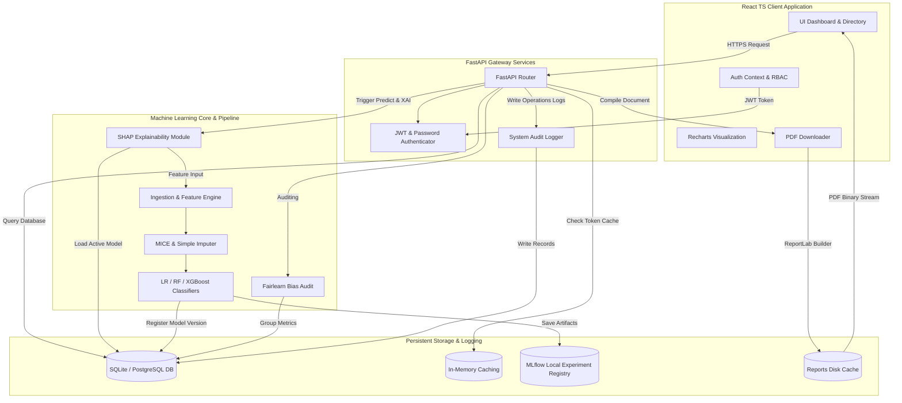
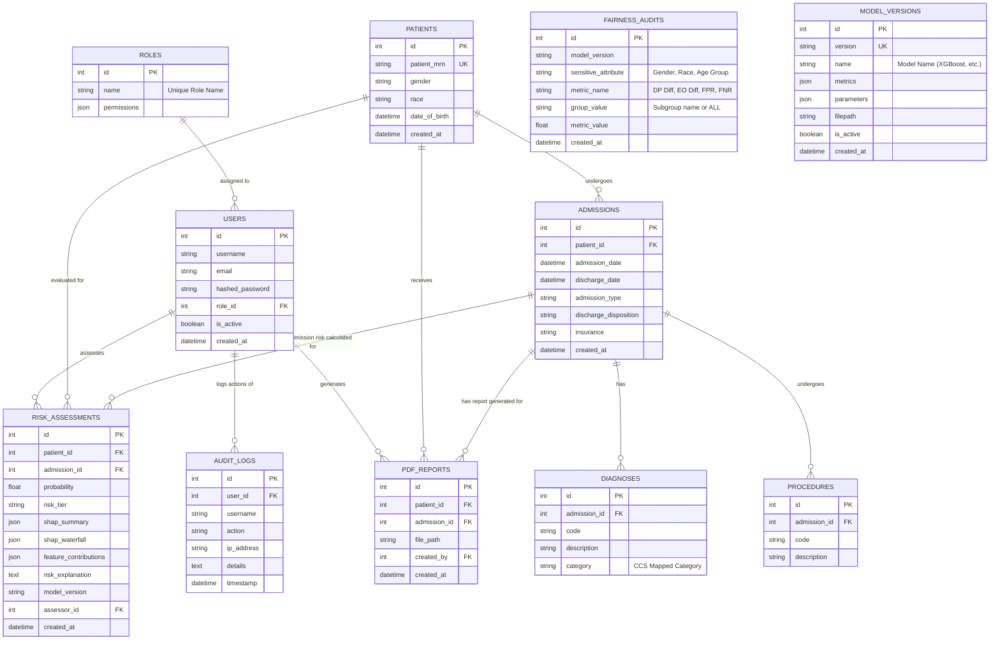

# CDSS System Architecture & Database ER Diagrams

This document contains visual diagrams mapping out the clinical decision support system's components, internal communication paths, and relational database schema.

---

## 1. System Architecture Diagram

The diagram below details the data flow between user sessions, API endpoints, internal pipelines, machine learning registries, and output reports.

---

## 2. Database Entity Relationship (ER) Diagram

The following diagram maps out our SQLAlchemy table models, indices, primary keys, and foreign keys.

